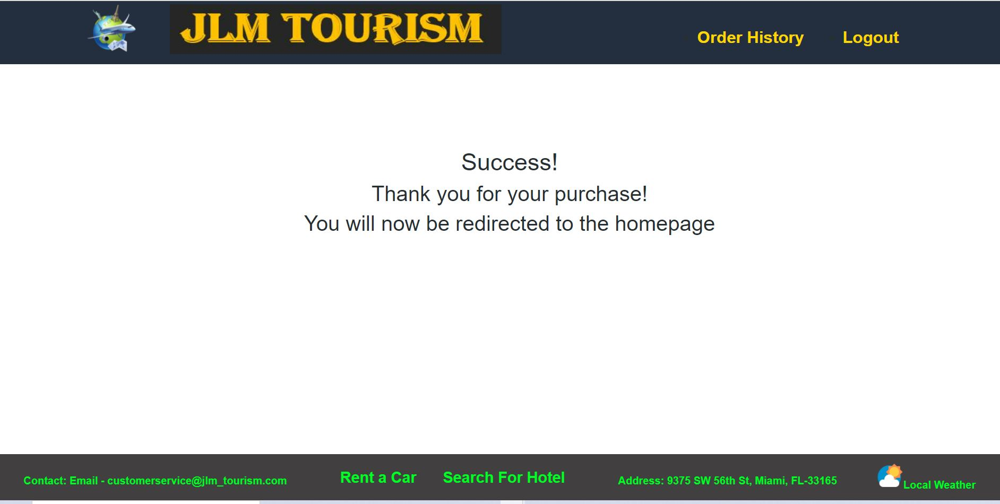

<h1 align="center">JLM TOURISM 👋</h1>

## Description

*JLM Tourism is one of the renowned name in the tourism industry of Florida. It could earn maxmimum possible customer satisfaction in this industry. To better serve and compete with the competetors, it was necessary to build an application that will give the customers to access JLM Tourism anytime from anywhere. In this application most effective and popular technologies like Mongoose, Express, React and Node.js are used. Besides It has also take the advantage of using Grapgql and redux instead of Context API. In this application, the customer can login to the system, select their product and pay for it. For payment process Stripe us been used.*


## Table of Contents

- [Description](#description)
- [Table of Contents](#table-of-contents)
- [App Screenshots](#app-screenshots)
- [Overview Links](#overview-links)
- [User Story](#user-story)
- [Acceptance Criteria](#acceptance-criteria)
- [Installation](#installation)
- [Tools](#tools)
- [Usage](#usage)
- [Contributing](#contributing)
- [Questions](#questions)
- [Copyright](#copyright)


## App Screenshots

- Picture of the Application Home Screen.


- Picture of Application with Cart


- Picture of Payment with Stripe


- Picture of Payment Success Message



- Order History.


## Overview Links
- [Application walkthrough](https://watch.screencastify.com/v/YrGWoL55svWsD4Odbhg8)

- [Application Deployed in Heroku](https://jlm-tourism.herokuapp.com/)

- [Github link](https://mirzadev.github.io/jlm-tourism/)


## User Story

```text
As a User of e-commerce I want to regularly visit an e-commerce web site where I can view product, it's price, and then decide to purchase my desired product.

AS a full Stack developer working on an e-commerce platform
I WANT my platform to use MERN and Redux to manage global state instead of the Context API
SO THAT my website's state management is taken out of the React ecosystem
```

## Acceptance Criteria

```text
As a user
GIVEN a tourism e-commerce site
WHEN I visit site
THEN I am presented with the home page with the option- Login and Signup options at the right side of the navbar. As soon as I sign, the navbar will display the option - Order History and Logout. There will always have a "Cart" at the right most corner of the navbar.  
WHEN I click on the Cart without login and without selecting any product
THEN the system will display a message that no product has been selected. As soon as any product is selected, it will be saved in the Checkout. The used will have the option to increase or decrease the number of product or delete the product. There will be no "Checkout" option till the user is logged in.
WHEN I choose to sign up
THEN I am prompted to create my account with first name, last name, email and password, and my credentials are saved and I am logged into the site .
WHEN I revisit the site at a later time and choose to sign in
THEN I am prompted to enter my email and password
WHEN I am signed in to the site
THEN I see the home page with all available products.
WHEN I click on the any product category
THEN I am prompted all available products in that category along with price and availability.
When I log into the site
THEN I can select any product by clicking on "Add to Cart"  
WHEN I click on any product, the individual product is displayed on the screen. 
WHEN I click on checkout 
THEN I see the page is navigated to a payment page using Stripe 
WHEN I complete the payment
THEN I see a success message and then navigated to the home page
WHEN I click on Order History
THEN I see list of all my product that I purchased of all the products in that category
WHEN I click on cart
THEN I see an empty cart
WHEN I click on the logout option in the navigation bar
THEN I am signed out of the site and navigated to the home page of the application
WHEN I Click on Contact:Email
THEN I find the app navigates to email process.
WHEN I click on Reant a Car
Then I find the app is linking me with the car rental company to manage my car using third party website.
WHEN I click on Search for Hotel
Then I find the app is linking me with the third party company website to manage my hotel needs during tour.
WHEN I Click on Address
THEN I find the app navigates to address including map direction.
WHEN I click on Local Weather
Then I find the app is linking me with the weather application that gives me weather updates during my tour. 


As a Full Stack Developer
GIVEN an e-commerce platform that uses MERN, PWA and Redux.
WHEN I review the app’s store
THEN I find that the app uses a Redux store instead of the Context API
WHEN I review the way the React front end accesses the store
THEN I find that the app uses a Redux provider
WHEN I review the way the app determines changes to its global state
THEN I find that the app passes reducers to a Redux store instead of using the Context API
WHEN I review the way the app extracts state data from the store
THEN I find that the app uses Redux instead of the Context API
WHEN I review the way the app dispatches actions
THEN I find that the app uses Redux instead of the Context API
WHEN I try to install the app in my desktop or Android
THEN I find the app is installable and can browse throught the application stand alone
WHEN I try to use the app off line
THEN I find the app working as normal.
```

## Installation
💾     
- npm install
- npm install @stripe/stripe-js

## Tools
- NodeJS
- MongoDB
- Apollo
- React
- Graphql
- Google Book API
- Express
- Stripe
- PWA

## Usage
💻   
  
Run the following command at the terminal:
  
`npm run seed`

`npm run develop`

`npm run build`

## Contributing

:Github Link: [Mirza Awal](https://github.com/mirzadev)
:Github Link: [Luis A Retana-Gaitan](https://github.com/lretana1)
:Github Link: [Jeremy McGuirk](https://github.com/Jeremymcg88)


## Questions
✉️ Contact me with any questions: [email](mailto:awal.mirza2016@gmail.com) , [LinkedIn](https://www.linkedin.com/in/mirza-awal-5972511b5/)

## Copyright

*This application is copyright protected and only owners are  
[Mirza Awal](https://github.com/mirzadev) ,
[Luis A Retana-Gaitan](https://github.com/lretana1) and
[Jeremy McGuirk](https://github.com/Jeremymcg88)*
